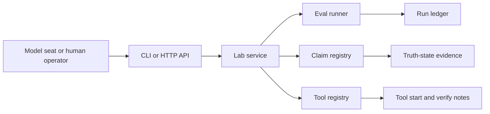

# Architecture

Codex Truth Lab has three layers.

## Source Layer

The committed repo contains the CLI, server, check runner, docs, tests, default config, and starter gates.

## Lab Room Layer

`lab-room` stores eval definitions and local ledgers. Committed config and evals are source. Runtime ledgers, local notes, and model-seat activity are ignored by git.

## Client Layer

Any model or automation client can interact through one of two paths:

- CLI commands for local agent workflows.
- HTTP routes for attached model seats and other tools.

The lab does not grant model authority by profile alone. A model is only operational when it uses real CLI/API calls and leaves evidence.

## Data Flow

## Design Rules

- Every eval produces structured results.
- Every stronger claim state requires evidence.
- Tool entries are pointers and verification recipes, not proof that a tool is currently running.
- Runtime files are intentionally separated from source review.

